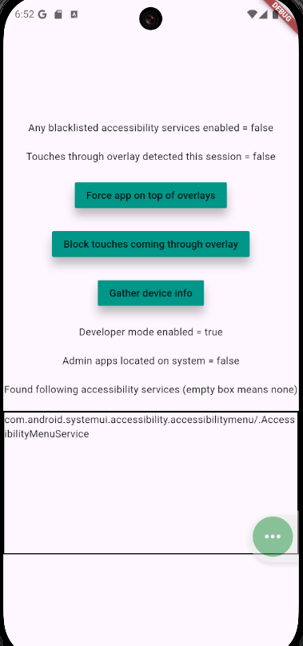

# Fraud Protection

A **Flutter plugin** providing runtime security protections for Android applications against common fraud, abuse, and malicious accessibility practices.  

This package helps developers protect their users by detecting **abusive accessibility services**, **user touches coming through overlays** and other suspicious behaviors.

This package needs 3 permissions for using all of its capabilities:
```
  <!-- Needed for putting the app on top of overlaying apps -->
   <uses-permission android:name="android.permission.HIDE_OVERLAY_WINDOWS"/>
   <!-- Needed for detecting ongoing calls -->
   <uses-permission android:name="android.permission.READ_PHONE_STATE" />
   <!-- Needed for detecting if microphone is being used -->
   <uses-permission android:name="android.permission.RECORD_AUDIO" />
```

If you wish to use only parts of its functionality don't forget to use `tools:node="remove"` in your manifest like so:
```
<uses-permission android:name="android.permission.READ_PHONE_STATE" tools:node="remove" />
```
---

## ✨ Features

- **Device Security Checks**
  - Detect if **Device Administrator apps** are active.
  - Detect if **Developer Mode** (or otherwise ADB/USB/WiFi debugging) is enabled.

- **Overlay Protections**
  - Block or hide malicious overlay windows.
  - Detect **obscured or partially obscured touches** (clickjacking/tapjacking defense).

- **Accessibility Monitoring**
  - Get a list of all active accessibility services.
  - Verify that **only whitelisted accessibility services** are active.
  - Detect if **any blacklisted accessibility services** are active (supports wildcards).

- **Event Streams**
  - Stream **touch events**. Monitor if your users interact with the app through a partial or full-screen overlay.
  - Stream **monitors added/removed.** Monitor if screen recording, mirroring or sharing started or stopped while your app is running. The display count refers to displays registered as public. As most displays register as private this number will in most cases remain around 0 or 1.
  - Stream information about **phone calls**. Make sure your customer is not using your app while being manipulated on a call.
  - Stream **microphone availability changes**. Most calls nowadays are over wifi, which means, they cannot be tracked as normal phone calls can. Instead **observe if microphone is currently in use by another app.** If it is, your customer might be instructed to screen-share or be in an internet call (such as messenger calls)



---

## 📖 Usage

See example for the fullest usage, including recommended one with LifecycleObserver.

### Device Security

```dart
final isAdminAppPresent = await FraudProtection.isDeviceAdminActive();
final isDevMode = await FraudProtection.isDeveloperModeEnabled();
```

### Overlay Protection

You can enable and disable these protections dynamically during runtime by passing true/false from anywhere in your app.

```dart
// Hide malicious overlay windows (Android 12+)
// Forces your application on top of any potential overlay
await FraudProtection.setHideOverlayWindows(true);

// Block touches if app is obscured by overlays
await FraudProtection.setBlockOverlayTouches(true);
```
#### Small caveat to overlays
Android OS treats active accessibility service overlay differently than a regular overlay coming from an app. This means that **there is no way of protection against overlay malware with active accessibility service**. That's why the next section is most important.
### Accessibility Checks

Get all active accessibility services
```dart
// Returns List<String>
final activeServices = await FraudProtection.getActiveAccessibilityServices();
```
Ensure only whitelisted services are active
```dart

// Accepts only full name package id + service name
// Returns bool
final safe = await FraudProtection.areAllAccessibilityServicesWhitelisted([
 "com.android.talkback/.TalkBackService",
  "com.google.android.marvin.talkback/.TalkBackService",
  "com.google.android.apps.accessibility.voiceaccess/.VoiceAccessService",
]);
```
Detect if any blacklisted services are active
```dart
// Since malware is more tricky accepts wildcards with *
// It's enough to know full or partial package name
// Returns bool
final unsafe = await FraudProtection.isAnyAccessibilityServiceBlacklisted([
  "com.malware.*",
  "com.fakebank.*",
]);
```
You can use pre-screened blacklist with known malware
```dart
// You can expand it with your own packages
// It is appreciated to make PR to package repo to add your package to baseline.
 await FraudProtection.isAnyAccessibilityServiceBlacklisted(
  FraudProtection.DEFAULT_ACCESSIBILITY_BLACKLIST + [] );
```

### Event Streams

Listen to touches coming through overlays

```dart
FraudProtection.touchEvents.listen((event) {
  // Handle obscured touch event
  print("Touch event detected: $event");
});
```
Listen to display changes. 

```dart
FraudProtection.displayEvents.listen((event) {
  // Handle display change event
  print("Display change detected: $event");
});

//Display events come as a full model
enum DisplayEventAction { added, removed, initial }

class DisplayEvent 
  final DisplayEventAction action;
  final int publicDisplayCount;
  final String message;

```
Listen to call events
```dart
FraudProtection.callEvents.listen((event) {
  // Handle call event
  isCallActiveNow = callEvent.callState == CallState.active
  print("Call event detected: $event");
});

//Call events come as a model
enum CallState { ringing, active, idle, unknown }

class CallEvent 
  final String event;
  final CallState callState;
```
Listen to microphone events
```dart
FraudProtection.microphoneEvents.listen((event) {
  // Handle microphone availability change event
   isMicrophoneInUse = microphoneEvent;
  print("Microphone availability change event detected: $event");
});
//Microphone availability come as a boolean. 
```
---

## ⚠️ Limitations

- This package is **Android-only**. iOS support is not currently available.
- Accessibility whitelisting/blacklisting is best-effort; **wildcards only support prefix matches**.

---

## 📌 Supported Platforms

- ✅ Android  
- ❌ iOS (planned) but to my knowledge most of these problems don't really apply there

---

## 🔒 Security Considerations

This plugin should be used as part of a **multi-layer security strategy**.  
It **does not guarantee complete protection** against advanced attacks.  
Always combine with:
- Server-side fraud detection
- Obfuscation and tamper checks
- Proper authentication and authorization controls
- Preferably a 3rd party solution like:
    - Android Integrity API
    - Threatmark
    - Appdome
    - etc

---

## Help expand the list of malware

Visit repository to **contribute** your services or packages into the whitelist and the blacklist

---

## 📜 License

MIT License © 2025
